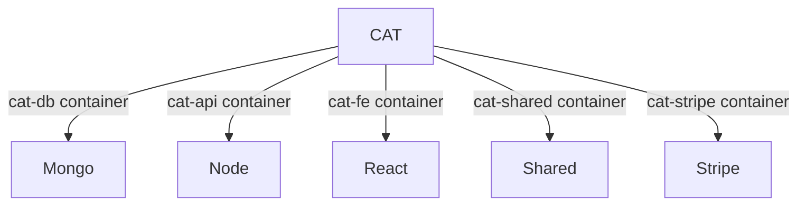

# CAT (startup repo)

[About](#about) | [Initial steps](#initial-steps) | [OS](#os) | [Local env](#how-to-startup-local-environment) | [Bash scripts](#manage-all-services-at-once-using-bash-scripts) | [Bash shell](#getting-bash-shell) | [DB actions](#database-actions)

## About

- this setup is best suited for development inside `Docker`
- VSCode's `Dev Containers` extension will be useful



## Initial steps

- make sure you have `Docker` up on your machine
- ask for `environment variables`

## OS

#### Add new entry to /etc/hosts file

```
127.0.0.1 host.docker.internal
```

## How to startup local environment

#### Clone this repo using https and GitHub personal access token

```
git clone https://<PAT>@github.com/Karmello/cat-start.git
```

#### Create `.env` file in the root of the project and fill it in with the right values

```
NODE_ENV=
CLIENT_PORT=
SERVER_PORT=
API_PORT=
API_PORT_TEST=
FE_URL=
API_URL=
API_PATH=
FULL_ACCOUNT_PAYMENT_REQUIRED=
MONGO_INITDB_ROOT_USERNAME=
MONGO_INITDB_ROOT_PASSWORD=
MONGO_URI=
MONGO_URI_TEST=
MONGO_URI_LOCAL=
MONGO_URI_DEV=
MONGO_URI_STAGING=
MONGO_URI_PROD=
AWS_ACCESS_KEY_ID=
AWS_SECRET_ACCESS_KEY=
AWS_BUCKET_URL=
AWS_BUCKET_NAME=
STRIPE_API_KEY=
DONATION_PAYMENT_LINK=
FULL_ACCOUNT_PAYMENT_LINK=
EMAIL_USER=
EMAIL_PASS=
ADMIN_USER_ID=
PAT=
RECAPTCHA_SITE_KEY=
AUTH_SECRET=
HONEYBADGER_API_KEY=
OPENAI_API_KEY=
```

#### Start Stripe (optional)

```
docker compose up --detach cat-stripe
```

#### Start database

```
docker compose up --detach cat-db
```

#### Build and start API

```
docker compose build --no-cache cat-api
```

```
docker compose up --detach cat-api
```

#### Build and start FE

```
docker compose build --no-cache cat-fe
```

```
docker compose up --detach cat-fe
```

#### Build and start shared repo

```
docker compose build --no-cache cat-shared
```

```
docker compose up --detach cat-shared
```

#### Manage all services at once using bash scripts

```
cmd/down
```

```
cmd/build
```

```
cmd/up
```

#### Verify services

```
http://localhost:9100
```

```
http://localhost:8100/info
```

```
http://localhost:3100
```

## Getting bash shell

#### Docker

```
docker exec -it cat-fe /bin/bash
```

```
docker exec -it cat-api /bin/bash
```

```
docker exec -it cat-shared /bin/bash
```

#### Heroku

```
heroku run bash -a cat-api-development
```

## Database actions

- there's `db` folder in the root of API repository
- it contains ready scripts to perform all sorts of db actions

#### Available actions

```
seed | seed-static | empty | check | notify | copyto | edit
```

#### Available environments

```
local | dev | staging | prod
```

#### Examples

```
yarn db local seed
```

```
yarn db prod check
```

```
yarn db prod copyto staging
```
