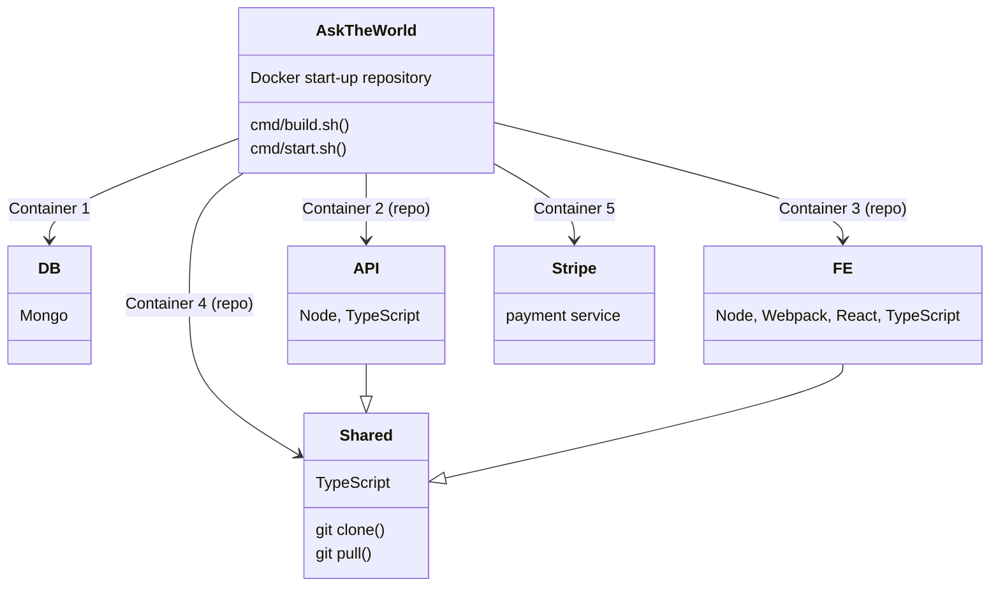

# Ask The World (startup repo)

## About

- this setup is best suited for development inside `Docker`
- VSCode's `Dev Containers` extension will be useful



## Initial steps

- make sure you have `Docker` up on your machine
- ask for `environment variables`

## OS

#### Add new entry to /etc/hosts file

```
127.0.0.1 host.docker.internal
```

## How to startup local environment

#### Clone this repo using https and GitHub personal access token

```
git clone https://<PAT>@github.com/Karmello/ask-the-world.git
```

#### Create `.env` file in the root of the project and fill it in with the right values

```
NODE_ENV=
CLIENT_PORT=
SERVER_PORT=
API_PORT=
API_PORT_TEST=
FE_URL=
API_URL=
API_PATH=
FULL_ACCOUNT_PAYMENT_REQUIRED=
MONGO_INITDB_ROOT_USERNAME=
MONGO_INITDB_ROOT_PASSWORD=
MONGO_URI=
MONGO_URI_TEST=
#MONGO_URI_TEST=
MONGO_URI_LOCAL=
MONGO_URI_MASTER=
MONGO_URI_STAGING=
MONGO_URI_PROD=
AWS_ACCESS_KEY_ID=
AWS_SECRET_ACCESS_KEY=
AWS_BUCKET_URL=
AWS_BUCKET_NAME=
STRIPE_API_KEY=
DONATION_PAYMENT_LINK=
FULL_ACCOUNT_PAYMENT_LINK=
EMAIL_USER=
EMAIL_PASS=
PAT=
RECAPTCHA_SITE_KEY=
AUTH_SECRET=
HONEYBADGER_API_KEY=
```

#### Run Stripe (optional)

```
docker-compose up --detach stripe
```

#### Run database

```
docker-compose up --detach db
```

#### Build and run API

```
docker-compose build --no-cache api
```

```
docker-compose up --detach api
```

#### Build and run FE

```
docker-compose build --no-cache fe
```

```
docker-compose up --detach fe
```

#### Build and run shared repo

```
docker-compose build --no-cache shared
```

```
docker-compose up --detach shared
```

#### Verify services

```
https://localhost:9100/info
```

```
https://localhost:8100/info
```

```
https://localhost:3100
```

## Getting bash shell

#### Docker

```
docker exec -it atw-fe /bin/bash
```

```
docker exec -it atw-api /bin/bash
```

```
docker exec -it atw-shared /bin/bash
```

#### Heroku

```
heroku run bash -a atw-api-br-main
```

## Database actions

- there's `db` folder in the root of API repository
- it contains ready scripts to perform all sorts of db actions

#### Available actions

```
seed | empty | check | notify | copyto | edit
```

#### Available environments

```
local | master | staging | prod
```

#### Examples

```
yarn db local seed
```

```
yarn db prod check
```

```
yarn db prod copyto staging
```
